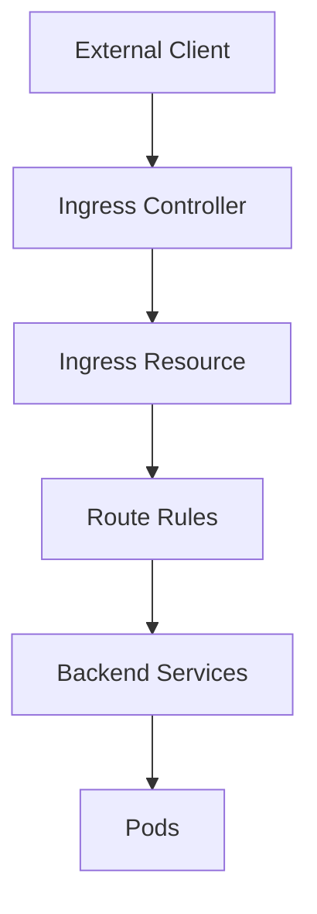

# Minikube Ingress Issues and Workarounds

## Overview

This document explains why ingress didn't work in our minikube cluster setup and provides alternative solutions for exposing services locally. It also covers the fundamental concepts of ingress, ingress controllers, and their benefits in Kubernetes environments.

## What is Ingress and Why Do We Need It?

### 1. The Problem Ingress Solves

In a typical Kubernetes cluster, you have multiple services that need to be accessible from outside the cluster:

```yaml
# Without Ingress - Multiple NodePort services
apiVersion: v1
kind: Service
metadata:
  name: frontend-service
spec:
  type: NodePort
  ports:
  - port: 80
    nodePort: 30001  # External port 30001

---
apiVersion: v1
kind: Service
metadata:
  name: backend-service
spec:
  type: NodePort
  ports:
  - port: 80
    nodePort: 30002  # External port 30002

---
apiVersion: v1
kind: Service
metadata:
  name: api-service
spec:
  type: NodePort
  ports:
  - port: 80
    nodePort: 30003  # External port 30003
```

**Problems with this approach:**
- **Port Management**: Each service needs a unique external port
- **URL Complexity**: Users must remember different ports (`app.com:30001`, `app.com:30002`)
- **SSL/TLS**: Each service needs individual SSL certificates
- **Load Balancing**: No intelligent routing based on paths or hosts
- **Security**: No centralized authentication or rate limiting

### 2. How Ingress Solves These Problems

Ingress provides a **single entry point** for external access with intelligent routing:

```yaml
# With Ingress - Single entry point with path-based routing
apiVersion: networking.k8s.io/v1
kind: Ingress
metadata:
  name: app-ingress
spec:
  rules:
  - host: myapp.com
    http:
      paths:
      - path: /
        pathType: Prefix
        backend:
          service:
            name: frontend-service
            port:
              number: 80
      - path: /api
        pathType: Prefix
        backend:
          service:
            name: backend-service
            port:
              number: 80
      - path: /admin
        pathType: Prefix
        backend:
          service:
            name: admin-service
            port:
              number: 80
```

**Benefits:**
- **Single Entry Point**: All traffic goes through port 80/443
- **Path-Based Routing**: `/api` routes to backend, `/` routes to frontend
- **Host-Based Routing**: `api.myapp.com` vs `www.myapp.com`
- **SSL Termination**: Single SSL certificate for all services
- **Load Balancing**: Built-in load balancing and health checks

### 3. Ingress Benefits

#### **A. Simplified Access**
```bash
# Without Ingress
curl http://myapp.com:30001/        # Frontend
curl http://myapp.com:30002/api     # Backend API
curl http://myapp.com:30003/admin   # Admin panel

# With Ingress
curl http://myapp.com/              # Frontend
curl http://myapp.com/api           # Backend API
curl http://myapp.com/admin         # Admin panel
```

#### **B. SSL/TLS Termination**
```yaml
apiVersion: networking.k8s.io/v1
kind: Ingress
metadata:
  name: app-ingress
  annotations:
    cert-manager.io/cluster-issuer: "letsencrypt-prod"
spec:
  tls:
  - hosts:
    - myapp.com
    - api.myapp.com
    secretName: app-tls-secret
  rules:
  - host: myapp.com
    http:
      paths:
      - path: /
        backend:
          service:
            name: frontend-service
            port:
              number: 80
```

#### **C. Advanced Routing**
```yaml
# Host-based routing
spec:
  rules:
  - host: www.myapp.com
    http:
      paths:
      - path: /
        backend:
          service:
            name: frontend-service
  - host: api.myapp.com
    http:
      paths:
      - path: /
        backend:
          service:
            name: backend-service

# Path-based routing with rewrites
spec:
  rules:
  - host: myapp.com
    http:
      paths:
      - path: /api/v1
        pathType: Prefix
        backend:
          service:
            name: backend-v1-service
      - path: /api/v2
        pathType: Prefix
        backend:
          service:
            name: backend-v2-service
```

#### **D. Security and Authentication**
```yaml
metadata:
  annotations:
    # Basic authentication
    nginx.ingress.kubernetes.io/auth-type: basic
    nginx.ingress.kubernetes.io/auth-secret: basic-auth
    nginx.ingress.kubernetes.io/auth-realm: 'Authentication Required'
    
    # Rate limiting
    nginx.ingress.kubernetes.io/rate-limit: "100"
    nginx.ingress.kubernetes.io/rate-limit-window: "1m"
    
    # CORS
    nginx.ingress.kubernetes.io/enable-cors: "true"
    nginx.ingress.kubernetes.io/cors-allow-origin: "https://myapp.com"
```

## What is an Ingress Controller?

### 1. The Role of Ingress Controller

An **Ingress Controller** is the actual implementation that processes the Ingress resources and handles the traffic routing. Think of it as the "traffic cop" that reads Ingress rules and directs traffic accordingly.



### 2. How Ingress Controller Works

#### **Step 1: Resource Watching**
```bash
# Ingress Controller watches for Ingress resources
kubectl get ingress
# NAME           CLASS   HOSTS        ADDRESS   PORTS   AGE
# app-ingress    nginx   myapp.com    1.2.3.4   80,443  5m
```

#### **Step 2: Configuration Generation**
The controller reads Ingress resources and generates configuration for the underlying proxy (Nginx, Traefik, etc.):

```nginx
# Generated Nginx configuration
server {
    listen 80;
    server_name myapp.com;
    
    location / {
        proxy_pass http://frontend-service.default.svc.cluster.local:80;
    }
    
    location /api {
        proxy_pass http://backend-service.default.svc.cluster.local:80;
    }
}
```

#### **Step 3: Traffic Routing**
```bash
# Traffic flow
Client Request: GET /api/users
    ↓
Ingress Controller (Nginx)
    ↓
Matches rule: path: /api → backend-service
    ↓
Routes to: backend-service:80
    ↓
Backend Pod responds
```

### 3. Popular Ingress Controllers

#### **A. NGINX Ingress Controller**
```yaml
# Most popular choice
apiVersion: networking.k8s.io/v1
kind: Ingress
metadata:
  name: app-ingress
  annotations:
    kubernetes.io/ingress.class: "nginx"
    nginx.ingress.kubernetes.io/rewrite-target: /
spec:
  rules:
  - host: myapp.com
    http:
      paths:
      - path: /
        backend:
          service:
            name: frontend-service
```

**Benefits:**
- Mature and stable
- Rich annotation support
- Good performance
- Extensive documentation

#### **B. Traefik Ingress Controller**
```yaml
# Modern alternative
apiVersion: networking.k8s.io/v1
kind: Ingress
metadata:
  name: app-ingress
  annotations:
    traefik.ingress.kubernetes.io/router.entrypoints: web,websecure
spec:
  rules:
  - host: myapp.com
    http:
      paths:
      - path: /
        backend:
          service:
            name: frontend-service
```

**Benefits:**
- Auto-discovery
- Built-in metrics
- Modern architecture
- Good for microservices

#### **C. AWS Load Balancer Controller**
```yaml
# For AWS environments
apiVersion: networking.k8s.io/v1
kind: Ingress
metadata:
  name: app-ingress
  annotations:
    kubernetes.io/ingress.class: alb
    alb.ingress.kubernetes.io/scheme: internet-facing
    alb.ingress.kubernetes.io/target-type: ip
spec:
  rules:
  - host: myapp.com
    http:
      paths:
      - path: /
        backend:
          service:
            name: frontend-service
```

### 4. Ingress Controller Benefits

#### **A. Centralized Traffic Management**
```yaml
# Single point of control for all external traffic
apiVersion: networking.k8s.io/v1
kind: Ingress
metadata:
  name: centralized-ingress
spec:
  rules:
  - host: myapp.com
    http:
      paths:
      - path: /
        backend:
          service:
            name: frontend-service
      - path: /api
        backend:
          service:
            name: backend-service
      - path: /admin
        backend:
          service:
            name: admin-service
      - path: /metrics
        backend:
          service:
            name: monitoring-service
```

#### **B. Advanced Features**
```yaml
metadata:
  annotations:
    # Canary deployments
    nginx.ingress.kubernetes.io/canary: "true"
    nginx.ingress.kubernetes.io/canary-weight: "10"
    
    # Request/Response modification
    nginx.ingress.kubernetes.io/configuration-snippet: |
      add_header X-Custom-Header "value";
    
    # Backend health checks
    nginx.ingress.kubernetes.io/upstream-hash-by: "$request_uri"
```

#### **C. Monitoring and Observability**
```yaml
# Ingress Controller exposes metrics
apiVersion: v1
kind: Service
metadata:
  name: ingress-nginx-controller-metrics
  namespace: ingress-nginx
spec:
  ports:
  - name: metrics
    port: 10254
    targetPort: 10254
```

**Available Metrics:**
- Request rate and latency
- Backend service health
- SSL certificate status
- Error rates by service

### 5. Ingress Controller vs LoadBalancer vs NodePort

| Feature | NodePort | LoadBalancer | Ingress |
|---------|----------|--------------|---------|
| **Port Management** | Manual port assignment | Automatic | Standard ports (80/443) |
| **SSL/TLS** | Per service | Per service | Centralized |
| **Routing** | None | None | Path/Host-based |
| **Load Balancing** | Basic | Advanced | Advanced |
| **Cost** | Free | Cloud provider cost | Free + controller cost |
| **Complexity** | Low | Medium | High |
| **Scalability** | Limited | Good | Excellent |

## Why Ingress is Essential in Production

### 1. Multi-Service Applications
```yaml
# Real-world example: E-commerce application
apiVersion: networking.k8s.io/v1
kind: Ingress
metadata:
  name: ecommerce-ingress
spec:
  rules:
  - host: shop.example.com
    http:
      paths:
      - path: /
        backend:
          service:
            name: frontend-service
      - path: /api
        backend:
          service:
            name: api-service
      - path: /admin
        backend:
          service:
            name: admin-service
      - path: /payment
        backend:
          service:
            name: payment-service
  - host: api.example.com
    http:
      paths:
      - path: /
        backend:
          service:
            name: api-service
  - host: admin.example.com
    http:
      paths:
      - path: /
        backend:
          service:
            name: admin-service
```

### 2. Microservices Architecture
```yaml
# Microservices with different versions
spec:
  rules:
  - host: myapp.com
    http:
      paths:
      - path: /api/v1
        backend:
          service:
            name: api-v1-service
      - path: /api/v2
        backend:
          service:
            name: api-v2-service
      - path: /api/v3
        backend:
          service:
            name: api-v3-service
```

### 3. Blue-Green Deployments
```yaml
# Canary deployment with Ingress
metadata:
  annotations:
    nginx.ingress.kubernetes.io/canary: "true"
    nginx.ingress.kubernetes.io/canary-weight: "10"  # 10% traffic to new version
spec:
  rules:
  - host: myapp.com
    http:
      paths:
      - path: /
        backend:
          service:
            name: frontend-service-v2  # New version
```

## Minikube-Specific Ingress Challenges

## Why Ingress Failed in Minikube

### 1. Minikube Cluster Architecture

Minikube creates a single-node Kubernetes cluster running inside a virtual machine (VM). The key characteristics that affect ingress are:

- **VM-based Architecture**: Minikube runs Kubernetes inside a VM (Docker Desktop, VirtualBox, etc.)
- **Network Isolation**: The VM has its own network interface separate from the host machine
- **Port Mapping**: Services need to be explicitly exposed to the host machine
- **Privileged Ports**: Ports 80 and 443 require special permissions and configuration

### 2. Ingress Controller Challenges

#### **Ingress Controller Service Type**
```yaml
# Default ingress controller service in minikube
apiVersion: v1
kind: Service
metadata:
  name: ingress-nginx-controller
  namespace: ingress-nginx
spec:
  type: NodePort  # Not LoadBalancer
  ports:
  - port: 80
    nodePort: 31832  # High port number
  - port: 443
    nodePort: 31652
```

**Issues:**
- Ingress controller runs as `NodePort`, not `LoadBalancer`
- Accessible only on high ports (31832, 31652), not standard ports (80, 443)
- Requires `minikube tunnel` to map to standard ports

#### **Minikube Tunnel Problems**
```bash
# This command often fails or requires sudo
minikube tunnel
```

**Common Issues:**
- **Privileged Port Access**: Requires sudo permissions for ports 80/443
- **Network Conflicts**: May conflict with existing services on host
- **Tunnel Instability**: Tunnel process can crash or become unresponsive
- **Firewall Issues**: Host firewall may block tunnel traffic
- **DNS Resolution**: Host header routing may not work correctly

### 3. Network Connectivity Issues

#### **Host-to-VM Communication**
```
Host Machine (192.168.0.103) 
    ↓ (Network Bridge)
Minikube VM (192.168.49.2)
    ↓ (Pod Network)
Kubernetes Pods (10.244.0.x)
```

**Problems:**
- **Double NAT**: Traffic goes through multiple network layers
- **Port Forwarding**: Complex port mapping between host and VM
- **Service Discovery**: DNS resolution issues between layers
- **Load Balancing**: Ingress controller may not receive traffic properly

## Specific Issues Encountered

### 1. Ingress Controller Not Accessible
```bash
# This failed consistently
curl -H "Host: monitoring-agent-app.local" http://192.168.49.2:80/
# Result: Connection timeout
```

**Root Cause:**
- Ingress controller not properly exposed on port 80
- Minikube tunnel not establishing correctly
- Network routing issues between host and VM

### 2. Backend Service Routing Issues
```bash
# Ingress configuration looked correct but didn't work
spec:
  rules:
  - host: monitoring-agent-app.local
    http:
      paths:
      - path: /api
        backend:
          service:
            name: backend-service
            port:
              number: 5000
```

**Issues:**
- Path rewriting problems
- Service endpoint discovery failures
- Backend service not receiving requests

### 3. Minikube Tunnel Failures
```bash
# Tunnel would start but then fail
minikube tunnel
# Output: "sudo permission will be asked for it"
# Then: "Stopped tunnel for service monitoring-agent-app-ingress"
```

## Workarounds and Solutions

### 1. NodePort Service (Implemented Solution)

**Advantages:**
- Simple and reliable
- No external dependencies
- Direct access to services
- Works consistently across different environments

**Implementation:**
```yaml
apiVersion: v1
kind: Service
metadata:
  name: monitoring-agent-app
spec:
  type: NodePort
  ports:
  - port: 8000
    targetPort: 8000
    nodePort: 30080  # Explicit port assignment
  selector:
    app: monitoring-agent-app
```

**Access:**
```bash
# Direct access via NodePort
curl http://$(minikube ip):30080/
```

### 2. Port Forwarding (Alternative Solution)

**Advantages:**
- No service type changes needed
- Works with any service type
- Simple to implement

**Implementation:**
```bash
# Forward frontend service
kubectl port-forward service/monitoring-agent-app 8080:8000

# Access via localhost
curl http://localhost:8080/
```

### 3. LoadBalancer with MetalLB (Advanced Solution)

**For Production-like Setup:**
```bash
# Install MetalLB in minikube
minikube addons enable metallb

# Configure IP range
minikube addons configure metallb
```

**Service Configuration:**
```yaml
apiVersion: v1
kind: Service
metadata:
  name: monitoring-agent-app
spec:
  type: LoadBalancer
  ports:
  - port: 80
    targetPort: 8000
```

### 4. Host Network Mode (Development Only)

**Warning: Not recommended for production**

```yaml
apiVersion: apps/v1
kind: Deployment
metadata:
  name: monitoring-agent-app
spec:
  template:
    spec:
      hostNetwork: true  # Use host network
      containers:
      - name: frontend
        ports:
        - containerPort: 8000
          hostPort: 8000  # Bind to host port
```

## Best Practices for Minikube Development

### 1. Service Exposure Strategy
```bash
# For development: Use NodePort or Port Forwarding
kubectl expose deployment monitoring-agent-app --type=NodePort --port=8000

# For testing: Use Port Forwarding
kubectl port-forward service/monitoring-agent-app 8080:8000
```

### 2. Network Debugging
```bash
# Check service endpoints
kubectl get endpoints

# Check service details
kubectl describe service monitoring-agent-app

# Check pod network
kubectl get pods -o wide

# Test internal connectivity
kubectl exec -it <pod-name> -- curl http://service-name:port
```

### 3. Alternative Development Tools

**Docker Desktop Kubernetes:**
- Better ingress support
- More production-like networking
- Easier service exposure

**Kind (Kubernetes in Docker):**
- Lightweight alternative
- Better network isolation
- Good for CI/CD

**K3s:**
- Lightweight Kubernetes
- Built-in load balancer
- Good for edge development

## Conclusion

The ingress failure in minikube was due to a combination of:
1. **Network Architecture**: VM-based isolation and port mapping issues
2. **Ingress Controller**: NodePort service type requiring tunnel setup
3. **Minikube Tunnel**: Unreliable privileged port access
4. **Service Discovery**: Complex routing through multiple network layers

**Our Solution:**
- **NodePort Services**: Direct, reliable access to frontend
- **Internal Backend**: Secure, cluster-internal communication
- **Simplified Deployment**: No ingress complexity
- **Port Forwarding**: Alternative access method when needed

This approach provides a stable, predictable development environment while maintaining the ability to test service-to-service communication within the cluster.

## References

- [Minikube Networking Documentation](https://minikube.sigs.k8s.io/docs/handbook/accessing/)
- [Kubernetes Service Types](https://kubernetes.io/docs/concepts/services-networking/service/)
- [Ingress Controller Troubleshooting](https://kubernetes.github.io/ingress-nginx/troubleshooting/)
- [Minikube Tunnel Issues](https://github.com/kubernetes/minikube/issues)
